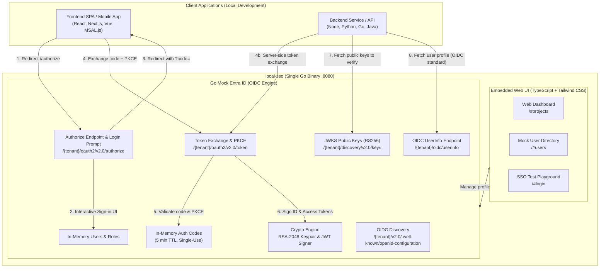
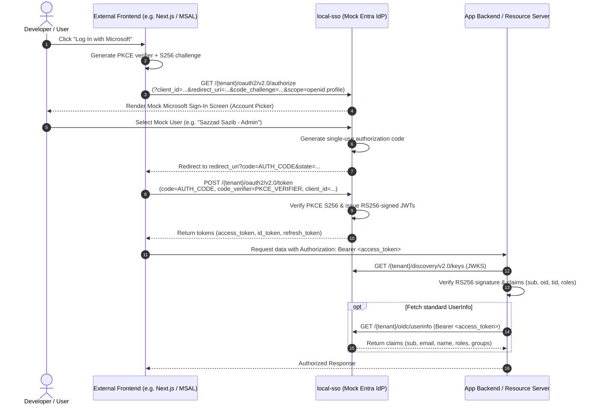

# local-sso

> **A single-binary developer tool that runs a Local Mock Microsoft Entra ID (OIDC) Identity Provider & In-App SSO Test Playground.**

Developed by **[Sazzad Sazib](https://github.com/sazzadsazib)** ([@sazzadsazib](https://github.com/sazzadsazib)).

[](https://local-sso.onrender.com)
[](https://golang.org)
[](https://www.typescriptlang.org)
[](https://tailwindcss.com)
[](LICENSE)

---

## 🌐 Live Cloud Demo

You can try `local-sso` immediately in your browser without installing anything:

👉 **[https://local-sso.onrender.com](https://local-sso.onrender.com)**

The live deployment lets you:
- Explore the interactive **Web Dashboard** (`/#projects`) and copy pre-assembled authorization URLs.
- Test the full OAuth2 Authorization Code + PKCE flow in the **Test Client Playground** (`/#login`).
- Inspect live RS256-signed **ID tokens and Access tokens** with real-time claims decoding.
- Manage mock users and custom claims in the **Mock User Directory** (`/#users`).

---

## 💡 Why Does `local-sso` Exist?

### The Pain Point
Integrating enterprise Single Sign-On (SSO) with **Microsoft Entra ID** (formerly Azure Active Directory) is standard in modern software. However, local development and testing are notoriously painful:

- **Cloud Dependency & Bureaucracy:** Setting up an Azure Tenant requires cloud accounts, creating App Registrations in the Azure Portal, configuring redirect URIs, generating secrets, and assigning licenses.
- **Permission & Consent Blockers:** Enterprise tenant policies often block developers from registering apps, requiring corporate IT tickets, admin consents, or domain verifications.
- **Offline & Local Friction:** Developers cannot work offline or on restricted networks without active internet access to `login.microsoftonline.com`.
- **Brittle CI/CD & Test Environments:** Automated tests that hit real Microsoft identity servers suffer from rate-limiting, expired secrets, MFA requirements, and flakiness.

### The Solution
`local-sso` eliminates this friction by running a **zero-dependency, local OAuth2 / OpenID Connect server** on `http://localhost:8080`:

- **Zero Cloud Setup:** No Azure account, no tenant configuration, and no cloud permissions needed.
- **Accepts Any App:** Any `client_id` and `redirect_uri` pair works immediately—no registration required!
- **Entra ID v2.0 Compatible:** Implements standard OpenID Connect discovery (`.well-known/openid-configuration`), JWKS endpoints (`/keys`), authorize prompt, and token exchange. Emits genuine Microsoft Entra v2.0 token claims schemas (`oid`, `tid`, `sub`, `roles`, `preferred_username`, etc.).
- **OIDC Extensions (e.g. UserInfo):** Provides standard OIDC endpoints like `/oidc/userinfo` that real Microsoft Entra omits, making `local-sso` drop-in compatible with generic OIDC libraries like NextAuth, Better Auth, and Spring Security.
- **Self-Contained & Instant:** Written in pure Go standard library with an embedded TypeScript + Tailwind CSS UI. Starts in milliseconds.
- **Built-in Playground:** Inspect tokens, verify RS256 cryptographic signatures, and switch mock user identities right inside your browser.

---

## 📂 Documentation Directory (`docs/`)

Comprehensive technical documentation, implementation guides, and architectural specifications are located in the [`docs/`](docs/) folder:

| Document | Purpose |
|---|---|
| 🛠️ **[`docs/development.md`](docs/development.md)** | **Complete Development & API Guide** — Local environment setup, hot-reload dev runner (`./run.sh`), dual-port proxying, codebase walkthrough, cross-compilation matrix, and full API specifications distinguishing standard Entra from mock extensions. |
| 🏛️ **[`docs/architecture.md`](docs/architecture.md)** | **Architecture & RFC Specs** — Deep dive into system internals, token claims shape, cryptographic signing, and RFC mappings. |
| 🚀 **[`docs/workspace-implementation.md`](docs/workspace-implementation.md)** | **Integration Guide** — Step-by-step walkthrough for integrating `local-sso` into a Next.js + Better Auth web application. |
| 📋 **[`docs/IMPLEMENTATION.md`](docs/IMPLEMENTATION.md)** | **Implementation Reference** — Historical implementation plan, test coverage details, and endpoint contracts. |
| 🔌 **[`docs/implementation-guide-for-mock-backend.md`](docs/implementation-guide-for-mock-backend.md)** | **Mock Backend Guide** — Patterns for mocking upstream OAuth2/OIDC servers. |

---

## 🏗️ How It Works

### High-Level Architecture

`local-sso` compiles into a single static binary containing both the Go HTTP Identity Provider server and the embedded Vite Single Page Application:



---

### End-to-End OAuth2 + PKCE Flow

Here is how an application logs in a user through `local-sso`:



---

## ⚡ Quick Start

### Option A — Run Prebuilt Binaries

Precompiled standalone binaries for every major OS and architecture are available in the [`bin/`](bin/) directory:

| OS | CPU | Binary Path | Run Command |
|---|---|---|---|
| **macOS** | Apple Silicon (M1/M2/M3/M4) | `bin/local-sso-darwin-arm64` | `./bin/local-sso-darwin-arm64 -port 8080` |
| **macOS** | Intel | `bin/local-sso-darwin-amd64` | `./bin/local-sso-darwin-amd64 -port 8080` |
| **Linux** | x86_64 | `bin/local-sso-linux-amd64` | `./bin/local-sso-linux-amd64 -port 8080` |
| **Linux** | ARM 64-bit (Graviton, Pi 4/5) | `bin/local-sso-linux-arm64` | `./bin/local-sso-linux-arm64 -port 8080` |
| **Windows** | x64 | `bin\local-sso-windows-amd64.exe` | `.\bin\local-sso-windows-amd64.exe -port 8080` |
| **Windows** | ARM64 | `bin\local-sso-windows-arm64.exe` | `.\bin\local-sso-windows-arm64.exe -port 8080` |

> **macOS Note:** If Gatekeeper blocks the binary, run `xattr -d com.apple.quarantine bin/local-sso-darwin-*`.  
> **Linux Note:** Ensure execute permissions with `chmod +x bin/local-sso-*`.

---

### Option B — Build From Source

The web UI is compiled and embedded directly into the Go binary (`//go:embed all:web/dist`).

#### One-Command Build:
```bash
# Linux / macOS / WSL
./build.sh

# Windows (PowerShell)
.\build.ps1
```

#### Manual Step-by-Step Build:
```bash
# Step 1: Build frontend (TypeScript + Tailwind CSS) -> web/dist
cd web && npm install && npm run build && cd ..

# Step 2: Build standalone Go binary
go build -o local-sso .
```

---

### Option C — `go install` (Serve From Anywhere)

```bash
# Frontend must already be built so web/dist is embedded
go install .

# Run from anywhere on your PATH
local-sso -port 8080
```

---

### Option D — Development Mode (Hot Reload with `./run.sh`)

One public port (`http://localhost:8080`) serves **everything**:

```bash
./run.sh                  # everything on http://localhost:8080
PORT=3000 ./run.sh        # pick a custom public port
GO_PORT=9091 ./run.sh     # pin the internal Go backend port
```

| Route on Public Port (`8080`) | Target Process |
|---|---|
| `/` (UI, HMR) | Vite dev server |
| `/api/*`, `/callback` | Proxied to the internal Go IdP |
| `/{tenant}/oauth2/*`, `/{tenant}/v2.0/*`, `/{tenant}/discovery/*`, `/oidc/userinfo` | Proxied to the internal Go IdP |

- Edit anything under `web/src/**` and the page hot-reloads instantly.
- The Go server is compiled to `.dev/local-sso-dev` before starting.
- `Ctrl+C` stops both processes cleanly.

#### Environment Configuration (`.env`):
```bash
cp .env.example .env
```

| Variable | Default | Description |
|---|---|---|
| `PORT` | `8080` | Public port serving UI + API + OIDC (what you open) |
| `GO_PORT` | auto (`8081`-`8100`) | Internal loopback port for the Go IdP, proxied by Vite |
| `SSO_BACKEND` | `http://localhost:$GO_PORT` | Vite proxy target |
| `TENANT` | `common` | Default tenant alias or GUID passed to `local-sso -tenant` |

---

## ⚙️ CLI Flags & Configuration

```bash
./local-sso [flags]
```

| Flag | Shorthand | Default | Description | Example |
|---|---|---|---|---|
| `-port` | `-p` | `8080` | Port to listen on (also reads `PORT` env var) | `local-sso -p 3000` |
| `-host` | `-h` | `127.0.0.1` | Network interface to bind (`0.0.0.0` for containers) | `local-sso -h 0.0.0.0` |
| `-tenant` | `-t` | `common` | Default tenant alias or GUID | `local-sso -t my-tenant-id` |
| `-base-url` | `-b` | `""` | Override base URL in OIDC metadata (e.g. ngrok or Render) | `local-sso -b https://xxxx.ngrok-free.app` |
| `-issuer-mode` | | `host` | Format of `iss` claim: `host` (origin) or `entra` | `local-sso -issuer-mode entra` |
| `-no-browser` | | `false` | Suppress auto-opening default web browser on launch | `local-sso -no-browser` |

---

## 💻 Integrating With Your Applications

### Step 1 — Start `local-sso`
```bash
./local-sso -port 8080
```

### Step 2 — Configure Your Client Settings
Open the dashboard at [`http://localhost:8080/#projects`](http://localhost:8080/#projects) and configure your project:

| Field | Meaning | Example |
|---|---|---|
| `Client ID` | Any value works (mock IdP, no registration needed) | `00000000-0000-0000-0000-000000000001` |
| `Redirect URI` | **Your frontend callback route** | `http://localhost:3000/callback` |
| `Tenant` | Alias or GUID used in every URL | `common` |
| `Host Origin / Base URL` | Custom host origin for ngrok tunnels or remote testing | `http://localhost:8080` |
| `Scope` | Space-separated scopes | `openid profile email offline_access` |

> **Ngrok Tunnel Support:** When running `ngrok http 8080`, simply set `Host Origin / Base URL` to your ngrok URL (`https://...ngrok-free.app`). All endpoints and snippets immediately update. The Go backend also auto-detects `X-Forwarded-Proto` and `X-Forwarded-Host`.

---

### Step 3 — Code Examples

#### A. MSAL.js / `@azure/msal-browser`

```typescript
import { PublicClientApplication, Configuration } from "@azure/msal-browser";

export const msalConfig: Configuration = {
  auth: {
    clientId: "00000000-0000-0000-0000-000000000001", // Any client ID works!
    authority: "http://localhost:8080/common",
    knownAuthorities: ["localhost:8080"],              // Required for non-microsoft host
    redirectUri: "http://localhost:3000/callback",
  },
  cache: {
    cacheLocation: "localStorage",
    storeAuthStateInCookie: false,
  },
};

export const msalInstance = new PublicClientApplication(msalConfig);
```

---

#### B. Standard OAuth2 + PKCE (Next.js / React / Vue / Vanilla)

```typescript
// 1. Generate PKCE Challenge
const verifier = btoa(String.fromCharCode(...crypto.getRandomValues(new Uint8Array(32))));
const challenge = btoa(await crypto.subtle.digest("SHA-256", new TextEncoder().encode(verifier)))
  .replace(/\+/g, "-").replace(/\//g, "_").replace(/=+$/, "");

// 2. Redirect user to authorize URL
const authUrl = `http://localhost:8080/common/oauth2/v2.0/authorize?` +
  `client_id=00000000-0000-0000-0000-000000000001` +
  `&response_type=code` +
  `&redirect_uri=${encodeURIComponent("http://localhost:3000/callback")}` +
  `&response_mode=query` +
  `&scope=openid+profile+email+offline_access` +
  `&state=12345` +
  `&code_challenge=${challenge}` +
  `&code_challenge_method=S256`;

window.location.href = authUrl;

// 3. In callback handler, exchange code for tokens
const res = await fetch("http://localhost:8080/common/oauth2/v2.0/token", {
  method: "POST",
  headers: { "Content-Type": "application/x-www-form-urlencoded" },
  body: new URLSearchParams({
    grant_type: "authorization_code",
    client_id: "00000000-0000-0000-0000-000000000001",
    redirect_uri: "http://localhost:3000/callback",
    code: new URLSearchParams(window.location.search).get("code")!,
    code_verifier: verifier,
  }),
});
const { access_token, id_token, refresh_token } = await res.json();
```

---

#### C. Direct cURL Token Exchange

```bash
curl -X POST http://localhost:8080/common/oauth2/v2.0/token \
  -H "Content-Type: application/x-www-form-urlencoded" \
  -d "grant_type=authorization_code" \
  -d "client_id=00000000-0000-0000-0000-000000000001" \
  -d "redirect_uri=http://localhost:3000/callback" \
  -d "code=<CODE_FROM_CALLBACK>" \
  -d "code_verifier=<PKCE_VERIFIER>"
```

---

## 📡 API Specifications: Standard Entra vs. local-sso Mock Extensions

`local-sso` provides both strict **Microsoft Entra ID v2.0 endpoints** and **mock extensions** designed to make local testing easier.

### 1. Standard Microsoft Entra ID (v2.0) Endpoints

These endpoints strictly match the request and response shapes of Microsoft Entra ID v2.0:

| Endpoint | Method | Entra Standard | Description |
|---|---|---|---|
| `/{tenant}/v2.0/.well-known/openid-configuration` | `GET` | ✅ Entra Standard | OpenID Connect Discovery document |
| `/{tenant}/discovery/v2.0/keys` | `GET` | ✅ Entra Standard | JWKS endpoint exposing active RSA-2048 public keys |
| `/{tenant}/oauth2/v2.0/authorize` | `GET` | ✅ Entra Standard | Interactive Mock Sign-in / Authorization Code prompt |
| `/{tenant}/oauth2/v2.0/token` | `POST` | ✅ Entra Standard | Authorization Code + PKCE and Refresh Token exchange |
| `/{tenant}/oauth2/v2.0/logout` | `GET` | ✅ Entra Standard | Logout endpoint handling post-logout redirects |

---

### 2. local-sso Mock Extensions & Non-Standard APIs

These endpoints and behaviors are **custom extensions added to local-sso** to bridge common friction points in local testing and generic OIDC library integrations:

| Endpoint / Feature | Method | Entra Standard | Purpose & Why It Exists |
|---|---|---|---|
| **`/{tenant}/oidc/userinfo`**<br/>(also `/oidc/userinfo`) | `GET`<br/>`POST` | ❌ **Non-Standard Entra**<br/>*(Standard OIDC RFC 5356)* | **OIDC UserInfo Endpoint.** Real Entra ID v2.0 does not expose a standard `/userinfo` endpoint (it forces the use of Microsoft Graph API). Generic libraries like Better Auth, NextAuth, and Spring Security require this endpoint. Returns `sub`, `email`, `name`, `email_verified: true`, `tid`, `oid`, `roles`, `groups`, and custom claims. |
| **`/api/token`** | `POST` | ❌ **Non-Standard Entra**<br/>*(local-sso Helper)* | **Browser CORS Token Exchange Proxy.** Accepts JSON payloads (`token_url`, `code`, `code_verifier`, etc.) and returns tokens with full `Access-Control-Allow-Origin: *` to prevent browser CORS blocks during SPA development. |
| **`/api/verify`** | `POST` | ❌ **Non-Standard Entra**<br/>*(local-sso Helper)* | **Token Signature & Claims Validator.** Validates RS256 JWT signatures against the local JWKS directly in JSON without requiring server-side crypto tools. |
| **`/api/discovery`** | `GET` | ❌ **Non-Standard Entra**<br/>*(local-sso Helper)* | **Discovery Normalizer.** Proxies and normalizes discovery metadata documents to inspect remote or local endpoints. |
| **`/api/users`**<br/>`POST /api/users`<br/>`PUT /api/users/{id}`<br/>`DELETE /api/users/{id}` | `GET`<br/>`POST`<br/>`PUT`<br/>`DELETE` | ❌ **Non-Standard Entra**<br/>*(local-sso Helper)* | **Programmatic User Directory CRUD.** Allows automated test suites and developers to programmatically seed, list, update, and delete mock user personas, roles, and token claims without needing Microsoft Graph admin permissions. |
| **`prompt=none` + `login_hint`** | Query Param | ❌ **Non-Standard Entra**<br/>*(local-sso Extension)* | **Headless Auto-Login.** In real Entra ID, `prompt=none` requires an active session cookie. In `local-sso`, passing `prompt=none&login_hint=<email>` immediately generates an authorization code without rendering the account picker, enabling lightning-fast CI/CD tests. |
| **Zero App Registration & Secret Bypass** | Runtime | ❌ **Non-Standard Entra**<br/>*(local-sso Extension)* | Any `client_id` is accepted, and `client_secret` is completely ignored at the token endpoint. |

---

### Web UI Routes

| Route | View |
|---|---|
| `http://localhost:8080/#projects` | Projects / Profiles configuration and copyable authorize URLs |
| `http://localhost:8080/#users` | Mock User Directory management UI |
| `http://localhost:8080/#login` | Interactive in-browser Test Client Playground & Token Inspector |
| `http://localhost:8080/#config` | Alias pointing to `#projects` |

---

## 🧪 Testing Inside This App Itself

`local-sso` includes an in-browser test suite so you can verify OAuth2 / OIDC flows without writing any client code:

1. **Open the Test Client**: Navigate to [`http://localhost:8080/#login`](http://localhost:8080/#login).
2. **Configure Test Parameters**:
   - Select which mock user to sign in as (e.g. `Sazzad Sazib`, `Iftekhar Rifat`).
   - Customize requested OAuth scopes (e.g. `openid profile email offline_access`).
   - Choose prompt behavior (`select_account`, `none`, or `consent`).
3. **Execute Flow**: Click **"Launch OAuth2 + PKCE Test Flow"**.
4. **Live Token & Claims Inspector**:
   - **Visual Profile**: Inspects `name`, `email`, `tid`, `oid`, and `roles`.
   - **JOSE Header & Decoded Claims**: Formatted JSON trees for ID token and Access token.
   - **Verify JWKS Signature**: One-click RS256 cryptographic verification against the local JWKS endpoint.
   - **Token Refresh**: One-click refresh test using `grant_type=refresh_token`.
   - **cURL Generator**: Copyable command with `Authorization: Bearer <token>` for testing your backend APIs.

---

## 👥 Mock User Directory

`local-sso` comes pre-seeded with realistic developer accounts:

- **Sazzad Sazib** (`sazib@gmail.com`) — Global Administrator (`roles: ["Admin", "User"]`)
- **Iftekhar Rifat** (`rifat@gmail.com`) — Senior Software Engineer (`roles: ["Developer", "User"]`)

You can create, update, or remove mock personas anytime via the in-app user directory (`/#users`) or the `/api/users` REST API.

---

## 🧪 Unit Testing

Run backend unit tests:
```bash
go test -v ./...
```

Verify frontend TypeScript compilation:
```bash
cd web && npm run build
```

---

## 🔒 Security Notice

`local-sso` is strictly intended for **local software development and automated testing**. It does not enforce client secret authentication and issues self-signed RSA certificates. Do not use this tool as an identity provider in production environments.

---

## 📄 License & Credits

Created and maintained by **[Sazzad Sazib](https://github.com/sazzadsazib)** ([@sazzadsazib](https://github.com/sazzadsazib)).  
Licensed under the [MIT License](LICENSE).
