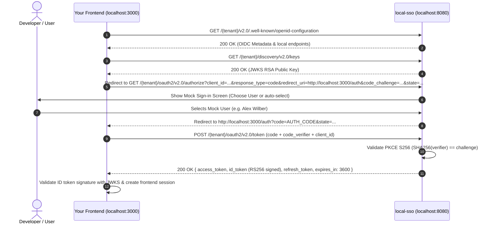

# local-sso — Implementation Plan

A **single Go binary** developer tool that serves as a **Local Mock Microsoft Entra ID (OIDC) Identity Provider** and a **built-in SSO Test & Management Playground**. 

Developers build and run the binary on `http://localhost:8080`. External frontend applications (e.g., React/Vue/Angular apps using MSAL.js or standard OAuth2/OIDC clients) can consume `local-sso` as their Entra ID provider to log in users, receive signed tokens, and establish SSO sessions locally. In parallel, developers can open the built-in Web UI to manage mock user identities, configure claims, inspect tokens, and test OAuth2 PKCE flows directly.

---

## 1. Goals & Scope

| Dimension | Decision |
|---|---|
| Runtime | Single Go binary, `go build -o local-sso ./` → `./local-sso -port 8080` |
| Primary Role | **Local Mock Entra ID Server (IdP)**: Emulates Microsoft Entra v2.0 endpoints for local frontends & backends |
| Secondary Role | **SSO Client & Management Playground**: Built-in UI to test flows, configure mock users, inspect tokens, and copy configs |
| Frontend Stack | Embedded into the binary via `//go:embed web` — zero external runtime files |
| UI Views | `http://localhost:8080/#login` (Test Client), `http://localhost:8080/#users` (Mock User Directory), `http://localhost:8080/#config` (Config & Endpoints) |
| Protocol Support | Microsoft Entra ID v2.0 & Generic OIDC: Authorization Code + PKCE (S256), `state`, `nonce`, refresh tokens, JWKS RS256 signing |
| Storage | Server in-memory/JSON store for mock users & active RSA signing keys; browser localStorage for UI profiles and test sessions |
| Tests | Unit tests only — **E2E is out of scope by design** |
| Documentation | `README.md` (quick start & MSAL.js integration guide) + `docs/IMPLEMENTATION.md` (full reference) |
| Dependencies | Go standard library only (`net/http`, `crypto/rsa`, `crypto/sha256`, etc.) — zero third-party modules |

### Out of scope
- Public/production internet deployment (localhost/loopback developer tool only)
- Native Windows Desktop GUI wrappers (web browser SPA only)

---

## 2. Project Structure

```
local-sso/
├── go.mod                      # module local-sso, go 1.27, stdlib only
├── main.go                     # CLI flags (-port, -tenant), //go:embed web, server bootstrap, localhost bind, auto-open browser
├── internal/
│   ├── idp/
│   │   ├── keys.go             # RSA keypair generation, JWKS JSON formatting (n, e, kid)
│   │   ├── signer.go           # RS256 JWT signing for id_token and access_token (Entra v2.0 claims shape)
│   │   ├── users.go            # Mock user directory (default users: Alex, Megan; custom user CRUD)
│   │   ├── codes.go            # Authorization code store with PKCE challenge + expiration
│   │   └── discovery.go        # Dynamic .well-known/openid-configuration generator for any tenant
│   ├── oauth/
│   │   ├── pkce.go             # RFC 7636 S256: verifier/challenge, state, nonce, constant-time compare
│   │   ├── authorize.go        # Entra/generic authorize URL builder + parameter parser
│   │   ├── token.go            # Token exchange logic, public-client query parameter support, error formatters
│   │   └── jwtid.go            # ID token (JWT) decoding for claim inspection
│   └── server/
│       ├── server.go           # Multiplexer, CORS middleware, embedded static serving, health/version endpoints
│       ├── idp_discovery.go    # GET /{tenant}/v2.0/.well-known/openid-configuration
│       ├── idp_keys.go         # GET /{tenant}/discovery/v2.0/keys (JWKS)
│       ├── idp_authorize.go    # GET /{tenant}/oauth2/v2.0/authorize (serves local interactive login prompt or auto-login)
│       ├── idp_token.go        # POST /{tenant}/oauth2/v2.0/token (handles authorization_code & refresh_token)
│       ├── idp_logout.go       # GET /{tenant}/oauth2/v2.0/logout (handles post_logout_redirect_uri)
│       ├── api_users.go        # GET/POST/PUT/DELETE /api/users (mock user management)
│       ├── callback.go         # GET /callback (built-in test client receiver)
│       └── apitoken.go         # POST /api/token (proxy relay for external upstream IDP testing)
├── web/
│   ├── index.html              # SPA shell; all views rendered via hash router (#login, #users, #config)
│   ├── app.js                  # Hash router, toast notifications, storage & API helpers
│   ├── auth_prompt.html        # Interactive mock login dialog served when an app redirects to /authorize
│   ├── users.js                # Mock user management UI (custom roles, email, groups, custom claims)
│   ├── config.js               # Copyable endpoints (Discovery, Token, Authorize, MSAL snippet, curl), profile CRUD
│   ├── login.js                # Built-in test client: PKCE flow, session inspection, refresh/logout
│   ├── callback.html           # Callback stub for built-in client testing
│   └── style.css               # Shared modern dark/light CSS styling
├── docs/
│   └── IMPLEMENTATION.md       # Full architecture and API reference
├── README.md                   # Quick start, MSAL.js / Frontend integration guide, configuration walkthrough
└── internal/.../*_test.go      # Comprehensive unit tests
```

---

## 3. How `local-sso` Works

### Workflow A: External Frontend Consuming `local-sso` as Entra IdP

Your frontend app (e.g. React running on `localhost:3000` using MSAL.js or `@azure/msal-browser`) configures `http://localhost:8080/common` (or a specific tenant GUID) as its authority.



#### Step Breakdown:
1. **Discovery & JWKS**:
   - The consumer app fetches `http://localhost:8080/{tenant}/v2.0/.well-known/openid-configuration`.
   - `local-sso` responds with JSON endpoints pointing to `http://localhost:8080/{tenant}/...`.
   - The app fetches `http://localhost:8080/{tenant}/discovery/v2.0/keys` to get the active RSA public key.
2. **Authorize Request**:
   - The frontend generates PKCE `code_verifier` & `code_challenge` (S256) and redirects to `http://localhost:8080/{tenant}/oauth2/v2.0/authorize`.
   - `local-sso` serves a clean **Mock Login Prompt** (`auth_prompt.html`) allowing the developer to pick which mock user account to sign in as (or customize claims on the fly).
   - Once selected, `local-sso` issues an authorization code, stores the associated PKCE challenge, and redirects back to the frontend's `redirect_uri?code=...&state=...`.
3. **Token Redemption**:
   - The frontend posts to `http://localhost:8080/{tenant}/oauth2/v2.0/token` with `grant_type=authorization_code`, `code`, and `code_verifier`.
   - `local-sso` computes `BASE64URL(SHA256(code_verifier))` and verifies it against the stored challenge.
   - `local-sso` signs an **RS256 JWT `id_token` and `access_token`** using its local RSA private key. The token includes standard Entra v2.0 claims:
     ```json
     {
       "aud": "<client_id>",
       "iss": "https://login.microsoftonline.com/{tenant}/v2.0",
       "iat": 1728240000,
       "exp": 1728243600,
       "nbf": 1728240000,
       "sub": "mock-user-sub-id",
       "oid": "mock-user-object-id",
       "tid": "mock-tenant-guid",
       "preferred_username": "alex@contoso.onmicrosoft.com",
       "name": "Alex Wilber",
       "roles": ["Admin", "User"],
       "scp": "openid profile email offline_access",
       "ver": "2.0"
     }
     ```
4. **Token Refresh**:
   - The frontend calls `POST /{tenant}/oauth2/v2.0/token` with `grant_type=refresh_token` to receive fresh tokens.

---

### Workflow B: Built-in Management & Test Client (`http://localhost:8080/#login`)

Developers can also test without an external app:
1. Open `http://localhost:8080/#login`.
2. Click **"Run Test Login"**.
3. It performs the full browser redirect flow against `local-sso`'s own authorize/token endpoints, exchanges the code, and lands on `http://localhost:8080/#login` showing decoded claims, token inspector, signature validation badge, and live refresh/logout testing buttons.

---

## 4. HTTP Endpoints (Go Server)

All endpoints support **CORS** (`Access-Control-Allow-Origin: *`, `Access-Control-Allow-Methods: GET, POST, OPTIONS`, `Access-Control-Allow-Headers: *`) to enable seamless frontend consumption.

| Endpoint | Method | Purpose |
|---|---|---|
| **IdP Endpoints** | | |
| `/{tenant}/v2.0/.well-known/openid-configuration` | GET | OpenID Connect Discovery document |
| `/{tenant}/discovery/v2.0/keys` | GET | JWKS endpoint serving RS256 RSA public key |
| `/{tenant}/oauth2/v2.0/authorize` | GET | Authorize endpoint: renders login prompt / returns auth code |
| `/{tenant}/oauth2/v2.0/token` | POST | Token endpoint: exchanges `authorization_code` or `refresh_token` |
| `/{tenant}/oauth2/v2.0/logout` | GET | End session / logout endpoint with `post_logout_redirect_uri` |
| **Management & Playground Endpoints** | | |
| `/` | GET | Serves embedded SPA shell (`index.html`) |
| `/static/*` | GET | Serves embedded CSS/JS assets from `web/` |
| `/callback` | GET | Built-in test client redirect landing page |
| `/api/users` | GET, POST | List, create, or update mock user directory |
| `/api/users/{id}` | PUT, DELETE | Edit or delete specific mock user profile |
| `/api/token` | POST | Proxy relay for testing external upstream IdPs (if needed) |
| `/healthz` | GET | Liveness probe (`{"status":"ok"}`) |
| `/api/version` | GET | Build & version metadata |

---

## 5. Web UI Features & Views

### 1. Mock User Directory (`#users`)
- Pre-populated with standard Microsoft test personas (e.g., `Alex Wilber`, `Megan Bowen`, `Adele Vance`).
- Ability to add/edit/delete users:
  - Display Name, Email / Preferred Username.
  - Tenant ID (`tid`), Object ID (`oid`), Subject (`sub`).
  - Roles (`roles: ["Admin", "Developer"]`).
  - Custom Claim key-value pairs (e.g. `department: "Engineering"`, `groups: ["guid1", "guid2"]`).

### 2. Config & Integration Snippets (`#config`)
- Live preview of all provider URLs for the active tenant.
- **Copyable Artifacts**:
  - **MSAL.js Config**: Ready-to-paste JavaScript/TypeScript configuration for `@azure/msal-browser`:
    ```javascript
    const msalConfig = {
      auth: {
        clientId: "your-client-id",
        authority: "http://localhost:8080/common",
        knownAuthorities: ["localhost:8080"],
        redirectUri: "http://localhost:3000/callback"
      }
    };
    ```
  - **OIDC Discovery URL**: `http://localhost:8080/common/v2.0/.well-known/openid-configuration`
  - **cURL Command Generator**: Code exchange & refresh token command templates.
  - **Launcher Link**: One-click deep link to start an automated test auth flow.

### 3. Built-in Test Client (`#login`)
- Full in-browser client to execute and debug PKCE flows against `local-sso` without writing any frontend code first.
- Decoded JWT viewer showing header, payload claims, and signature verification status.
- Token countdown timer and live refresh button.

---

## 6. Security Design & Developer Safety Rails

- **Loopback Binding**: Listens exclusively on `localhost` to prevent unauthorized external network access.
- **RFC 7636 PKCE Enforcement**: `code_challenge` (S256) is securely stored and validated against `code_verifier` with constant-time SHA-256 matching.
- **Single-Use Authorization Codes**: Auth codes expire after 5 minutes and are invalidated immediately upon redemption.
- **Isolated Local Keys**: RSA 2048-bit keypair is generated on startup (or persisted in-memory/temp config), ensuring tokens generated by `local-sso` cannot be mistaken for production Microsoft tokens.
- **Clear Dev Indicator**: Tokens include a distinct `"iss": "http://localhost:8080/{tenant}/v2.0"` (or configurable Entra-compatible issuer) so production systems are protected.

---

## 7. Unit Testing Strategy

| Module | Test Coverage |
|---|---|
| `internal/idp/keys_test.go` | RSA key generation, JWKS JSON export, `kid` matching, public exponent & modulus encoding |
| `internal/idp/signer_test.go` | JWT signing with RS256, claim structure compliance with Entra v2.0, token expiration validation |
| `internal/idp/codes_test.go` | Auth code lifecycle: generation, single-use invalidation, expiration timeout, PKCE validation |
| `internal/idp/discovery_test.go` | Dynamic OpenID configuration generation for `common`, `organizations`, `consumers`, and custom GUID tenants |
| `internal/idp/users_test.go` | User store CRUD, custom claim propagation into JWT payloads |
| `internal/oauth/pkce_test.go` | RFC 7636 Appendix B test vector, challenge determinism, constant-time compare |
| `internal/server/server_test.go` | Route matching for `/{tenant}/...`, CORS headers on GET/POST/OPTIONS, token exchange endpoint handling |

---

## 8. Execution Roadmap

| # | Task | Description | Status |
|---|---|---|---|
| 1 | Toolchain Setup | Verify Go 1.27 environment | ✅ Done |
| 2 | Implementation Plan | Update `implementation.md` to dual-mode (Mock IdP + Client Playground) | ✅ Done |
| 3 | Core IdP Modules (`internal/idp`) | RSA key management, JWKS generation, RS256 JWT signer, mock user store, auth code store | ⏳ Next |
| 4 | OAuth/PKCE Helpers (`internal/oauth`) | PKCE generator/verifier, URL builders, JWT claim decoders | ⏳ Pending |
| 5 | HTTP Server & Endpoints (`internal/server`) | Discovery, JWKS, Authorize prompt, Token exchange, User API, CORS middleware, `main.go` | ⏳ Pending |
| 6 | Frontend Shell & Views (`web/`) | `index.html`, `style.css`, `app.js`, `auth_prompt.html` (interactive mock login), `#users`, `#config`, `#login` | ⏳ Pending |
| 7 | Unit Tests & Build Verification | Run `go test ./...`, `go vet ./...`, and `go build -o local-sso .` | ⏳ Pending |
| 8 | Documentation Deliverables | `README.md` (with MSAL.js & frontend integration guide) and `docs/IMPLEMENTATION.md` | ⏳ Pending |